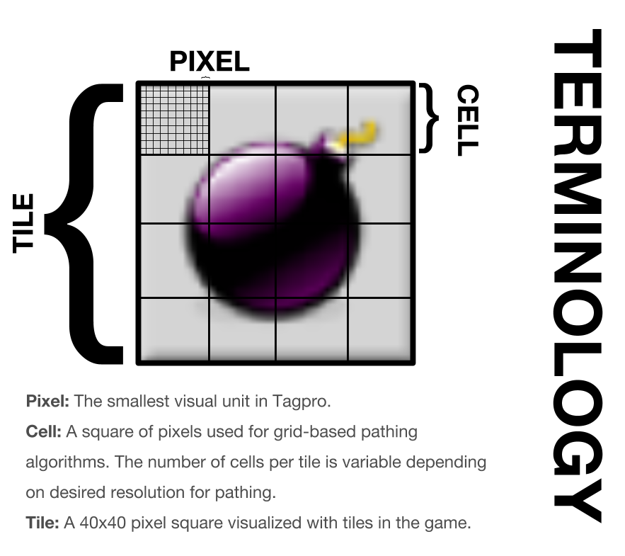
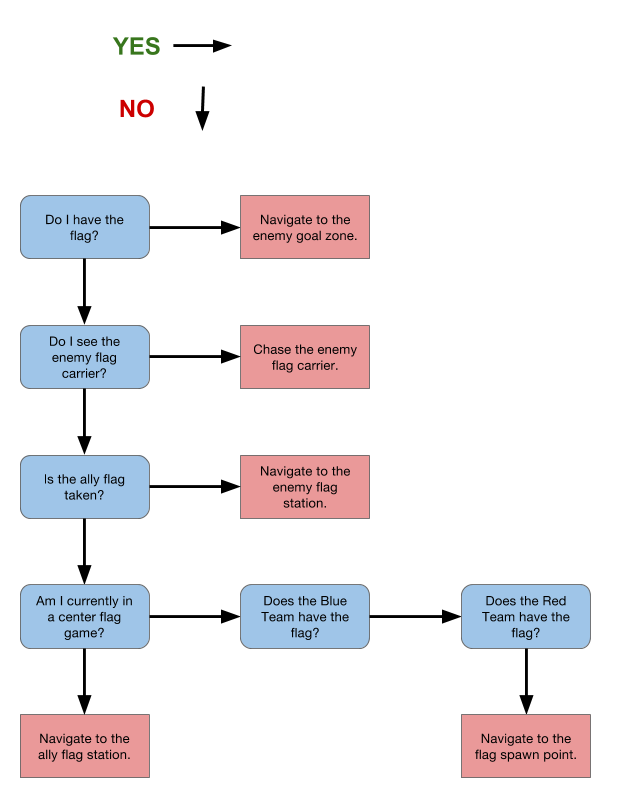

# tagprobot
## Installation
1. Install NVM using terminal:
```sh
curl -o- https://raw.githubusercontent.com/creationix/nvm/v0.33.2/install.sh | bash
```
2. Restart your bash session and install node using NVM: `nvm install node`
3. In this directory, install the node packages, including webpack: `npm install`

## Testing the App
- Run `npm test`. This will run all the test files

## Auto-linting your code
- Run `npm run lint:fix`. This lint your code and perform any fixes that can be done automatically. It will then give a report of what you still need to fix.


## Running the App
- Run `npm run build`.  This will start webpack, which will "watch" the files in `src/` and will update the bundle automatically.  This will also run eslint whenever your code changes so you can see if the linter fails.
- `npm run build:test` behaves similarly to `npm run build`, except it will also automatically run unit tests whenever you save a file it is watching, or save a test file
- You can append `:once` to either of the previous commands to run webpack without watching the files for changes. `npm run build:once` and `npm run build:test:once`.
- To test your code in tagpro, make sure webpack is running and copy-paste the code in `public/bundle.js` into tampermonkey.

## Terminology



[Editable link (Note that this doesn't also update this
README)](https://docs.google.com/drawings/d/18z9lRNxtATF4BkE7FFKQNEzWvFpPLd7EQOYPj2sTDok/edit)

## Current bot control logic



[Edittable link (Note that this doesn't also update this README)](https://docs.google.com/drawings/d/1dATBh8-rJaJgQ8SCulkl_3XUK_18F7JSp6zsTquQ4uQ/edit)

# Possible Development Strategy
First, let's aim to compete in the single-flag map "Command Center". Tentative competition date is in two weeks.
Command Center: http://i.imgur.com/aBaFYDB.png  
Command Center Testing Map: http://maps.jukejuice.com/maptest/3307/ca

Read up on TagPro's bot rules before running anything
https://www.reddit.com/r/tagprobots/comments/2vtgru/how_to_prevent_unnecessary_bot_bans/

idk this could be useful
https://www.reddit.com/r/TagPro/comments/3ii5xq/userscript_live_map_editor_and_partially_offline/
## Goal 0: Infrastructure
 - Get connected to the TagPro API
 - potentially use https://github.com/chrahunt/tagpro-dot-bot
  - https://gist.github.com/chrahunt/90d1c4aab5ad81ec4812
 - Other helpful information:
  - https://www.reddit.com/r/tagpro/wiki/modding
  - https://www.reddit.com/r/TagPro/wiki/api

## Goal 1: Maneuvering Safely
 - Don't hit things that kill you
 - Don't get stuck on walls or corners

## Goal 2: Maneuvering Swiftly
 - Get flag
 - Boosts?
 - Bombs?
 - Portals?

## Goal 3: Maneuvering Smartly
 - Intermediately goal selection
 - Jukes
 - Good grabbing
 - Machine learning? https://www.reddit.com/r/tagprobots/comments/5ptfrg/dataset_of_1900_tagpro_replays_from_the/
 
## Goal 4: ???

## Goal 5: Profit
